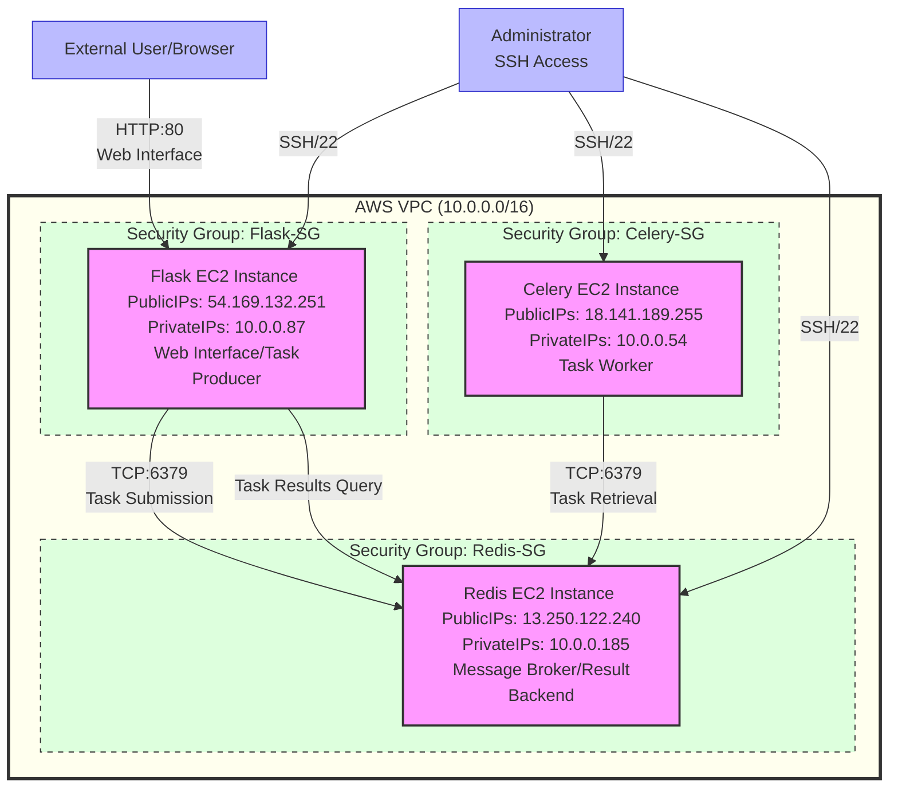

# Deploying a Distributed Task Queue Architecture on AWS EC2

## Introduction
In this tutorial, we'll walk through how to deploy a distributed task processing application on AWS using Flask, Celery, and Redis. This architecture allows for efficient, scalable task processing across multiple servers.

**Date**: 2025-05-24

---

## Architecture Overview

### AWS Architecture
Our architecture consists of three separate EC2 instances:
1. **Redis Instance**: Acts as the message broker and result backend.
2. **Flask Instance**: Serves the web interface and enqueues tasks.
3. **Celery Instance**: Processes tasks asynchronously.

This separation provides better scalability and fault tolerance compared to running everything on a single server.
# AWS Architecture Diagram for Distributed Task Queue

## System Architecture


---

## Prerequisites
- AWS account with permissions to create EC2 instances.
- Basic understanding of Flask, Celery, and Redis.
- SSH access to EC2 instances.

---

## Step 1: Clone the Repository
First, clone the repository on all three instances:
```bash
git clone https://github.com/Jilan5/poridhi---task-management-queue-using-celery-redis-and-flask.git app
cd app
```

---

## Step 2: Set Up Redis EC2 Instance
1. Launch an EC2 instance for Redis.
2. SSH into the instance and install Redis:
   ```bash
   sudo apt update
   sudo apt install redis-server -y
   ```
3. Configure Redis to accept remote connections:
   ```bash
   sudo nano /etc/redis/redis.conf
   ```
   - Change `bind 127.0.0.1` to `bind 0.0.0.0 -::1`.
   - Add or uncomment `requirepass 123` (use a stronger password in production).

4. Restart Redis to apply changes:
   ```bash
   sudo systemctl restart redis
   sudo systemctl status redis
   ```

---

## Step 3: Set Up Celery EC2 Instance
1. Install dependencies:
   ```bash
   sudo apt update
   sudo apt install python3-pip python3-venv git -y

   cd app
   python3 -m venv venv
   source venv/bin/activate

   pip install -r requirements.txt
   ```
2. Create the `app.py` file for Celery:
   ```bash
   nano app.py
   ```
   ```python
   from celery import Celery
   import logging
   
   # Configure logging
   logging.basicConfig(level=logging.DEBUG)
   logger = logging.getLogger(__name__)
   
   # Define Celery configuration
   REDIS_HOST = '13.250.122.240'  # Replace with your Redis EC2 IP
   REDIS_PORT = 6379
   REDIS_PASSWORD = '123'
   BROKER_URL = f'redis://:{REDIS_PASSWORD}@{REDIS_HOST}:{REDIS_PORT}/0'
   RESULT_BACKEND = f'redis://:{REDIS_PASSWORD}@{REDIS_HOST}:{REDIS_PORT}/0'
   
   # Create Celery instance
   celery = Celery(
       'tasks',  # Important: Use a consistent app name across instances
       broker=BROKER_URL,
       backend=RESULT_BACKEND
   )
   
   # Configure serialization
   celery.conf.update(
       task_serializer='json',
       accept_content=['json'],
       result_serializer='json',
       broker_connection_retry_on_startup=True
   )
   
   @celery.task(name='tasks.divide')
   def divide(x, y):
       import time
       time.sleep(5)  # Simulate a time-consuming task
       return x / y
   ```

3. Create a systemd service for Celery:
   ```bash
   sudo nano /etc/systemd/system/celery.service
   ```
   Add the following content:
   ```ini
   [Unit]
   Description=Celery Service
   After=network.target

   [Service]
   User=ubuntu
   WorkingDirectory=/home/ubuntu/app
   Environment="PATH=/home/ubuntu/app/venv/bin"
   ExecStart=/home/ubuntu/app/venv/bin/celery -A app.celery worker --loglevel=info
   Restart=always

   [Install]
   WantedBy=multi-user.target
   ```

4. Start the Celery service:
   ```bash
   sudo systemctl enable celery
   sudo systemctl start celery
   sudo systemctl status celery
   ```

---

## Step 4: Set Up Flask EC2 Instance
1. Install dependencies:
   ```bash
   sudo apt update
   sudo apt install python3-pip python3-venv git nginx -y

   cd app
   python3 -m venv venv
   source venv/bin/activate

   pip install -r requirements.txt
   pip install gunicorn
   ```
2. Create the `app.py` file for Flask:
   ```bash
   nano app.py
   ```
   ```python
   from celery import Celery
   from flask import Flask, request, jsonify
   import logging
   import os
   
   # Configure logging
   logging.basicConfig(level=logging.DEBUG)
   logger = logging.getLogger(__name__)
   
   app = Flask(__name__)
   
   # Define Celery configuration
   REDIS_HOST = '13.250.122.240'  # Replace with your Redis EC2 IP
   REDIS_PORT = 6379
   REDIS_PASSWORD = '123'
   BROKER_URL = f'redis://:{REDIS_PASSWORD}@{REDIS_HOST}:{REDIS_PORT}/0'
   RESULT_BACKEND = f'redis://:{REDIS_PASSWORD}@{REDIS_HOST}:{REDIS_PORT}/0'
   
   # Create Celery instance
   celery = Celery(
       'tasks',  # Important: Use a consistent app name across instances
       broker=BROKER_URL,
       backend=RESULT_BACKEND
   )
   
   # Configure serialization
   celery.conf.update(
       task_serializer='json',
       accept_content=['json'],
       result_serializer='json',
       broker_connection_retry_on_startup=True
   )
   
   @app.route("/")
   def hello():
       return """
       <h1>Task Management with Celery</h1>
       <form action="/submit_task" method="get">
           <label for="x">Number 1:</label>
           <input type="number" id="x" name="x" value="10"><br><br>
           <label for="y">Number 2:</label>
           <input type="number" id="y" name="y" value="2"><br><br>
           <input type="submit" value="Calculate Division">
       </form>
       <p>Redis Host: {}</p>
       """.format(REDIS_HOST)
   
   @app.route("/submit_task")
   def submit_task():
       try:
           x = int(request.args.get('x', 10))
           y = int(request.args.get('y', 2))
           
           logger.info(f"Submitting task with x={x}, y={y}")
           
           # Submit task to Celery
           task = divide.delay(x, y)
           task_id = task.id
           
           logger.info(f"Task submitted with ID: {task_id}")
           
           return f"""
           <h1>Task Submitted</h1>
           <p>Task ID: {task_id}</p>
           <p>Status: <a href="/check_task/{task_id}">Check Status</a></p>
           <p><a href="/">Back to Home</a></p>
           """
       except Exception as e:
           logger.error(f"Error submitting task: {str(e)}", exc_info=True)
           return f"""
           <h1>Error Submitting Task</h1>
           <p>Error: {str(e)}</p>
           <p><a href="/">Back to Home</a></p>
           """
   
   @app.route("/check_task/<task_id>")
   def check_task(task_id):
       try:
           task = celery.AsyncResult(task_id)
           
           if task.ready():
               if task.successful():
                   result = task.get()
                   status = "Success"
               else:
                   result = str(task.result)
                   status = "Failed"
           else:
               result = "Task still processing..."
               status = "Processing"
           
           return f"""
           <h1>Task Status</h1>
           <p>Task ID: {task_id}</p>
           <p>Status: {status}</p>
           <p>Result: {result}</p>
           <p><a href="/check_task/{task_id}">Refresh</a></p>
           <p><a href="/">Back to Home</a></p>
           """
       except Exception as e:
           logger.error(f"Error checking task: {str(e)}", exc_info=True)
           return f"""
           <h1>Error Checking Task</h1>
           <p>Error: {str(e)}</p>
           <p><a href="/">Back to Home</a></p>
           """
   
   @celery.task(name='tasks.divide')
   def divide(x, y):
       import time
       time.sleep(5)  # Simulate a time-consuming task
       return x / y
   
   if __name__ == "__main__":
       app.run(debug=True, host="0.0.0.0")
   ```   


3. Create a systemd service for Flask:
   ```bash
   sudo nano /etc/systemd/system/flask.service
   ```
   Add the following content:
   ```ini
   [Unit]
   Description=Flask web application
   After=network.target

   [Service]
   User=ubuntu
   WorkingDirectory=/home/ubuntu/app
   Environment="PATH=/home/ubuntu/app/venv/bin"
   ExecStart=/home/ubuntu/app/venv/bin/gunicorn -b 0.0.0.0:5000 app:app
   Restart=always

   [Install]
   WantedBy=multi-user.target
   ```

4. Start the Flask service:
   ```bash
   sudo systemctl enable flask
   sudo systemctl start flask
   sudo systemctl status flask
   ```

---

## Step 5: Network Security Strategy for EC2 Instances
**Redis EC2 Security Group Configuration**:
- Inbound Rules:
  - Type: Custom TCP, Port Range: 6379, Source: Private IPs of Flask and Celery instances.

**Flask EC2 Security Group Configuration**:
- Inbound Rules:
  - Type: HTTP, Port Range: 80, Source: Anywhere (0.0.0.0/0).

**Celery EC2 Security Group Configuration**:
- Inbound Rules:
  - Type: SSH, Port Range: 22, Source: Your IP.

---

## Step 6: Testing the Deployment
1. Access the Flask application:
   ```
   http://flask-ec2-public-ip
   ```
2. Submit a division task and check its status.

---


## Common Deployment Errors and Solutions
### 1. Internal Server Error
- **Cause**: Configuration issues like inconsistent Celery app naming or incorrect Redis connection string.
- **Solution**: Use consistent app names and proper Redis URLs.

### 2. Redis Connection Refused
- **Cause**: Celery pointing to localhost instead of the Redis instance.
- **Solution**: Update the broker URL in `app.py`.

### 3. Security Group Issues
- **Cause**: Incorrect rules for inter-instance communication.
- **Solution**: Update security group rules as specified above.

---

## Conclusion
This distributed architecture separates concerns across three EC2 instances, making the application more scalable and resilient. Follow proper configuration practices to ensure reliable communication between all components.
